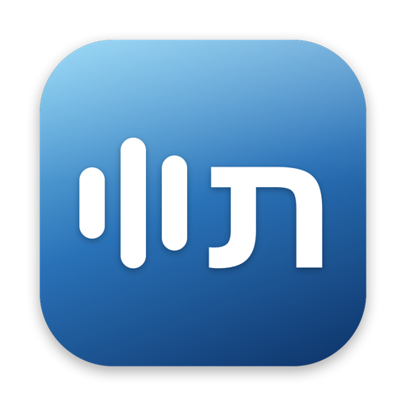
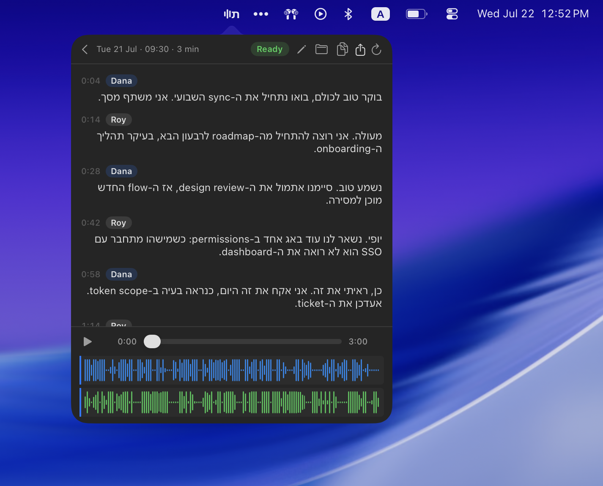
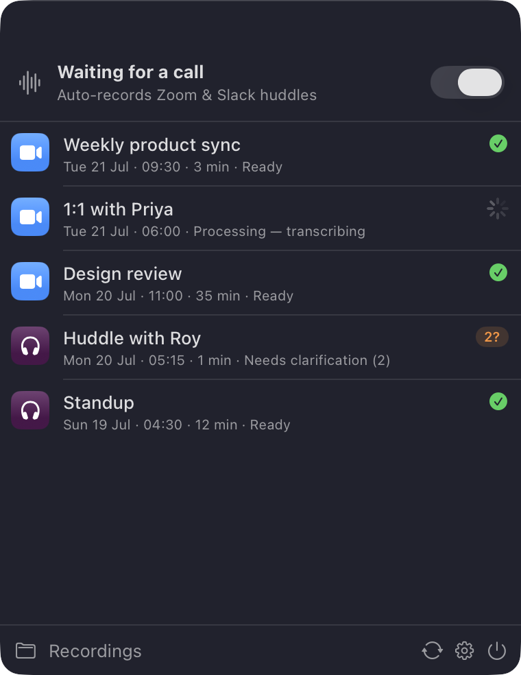
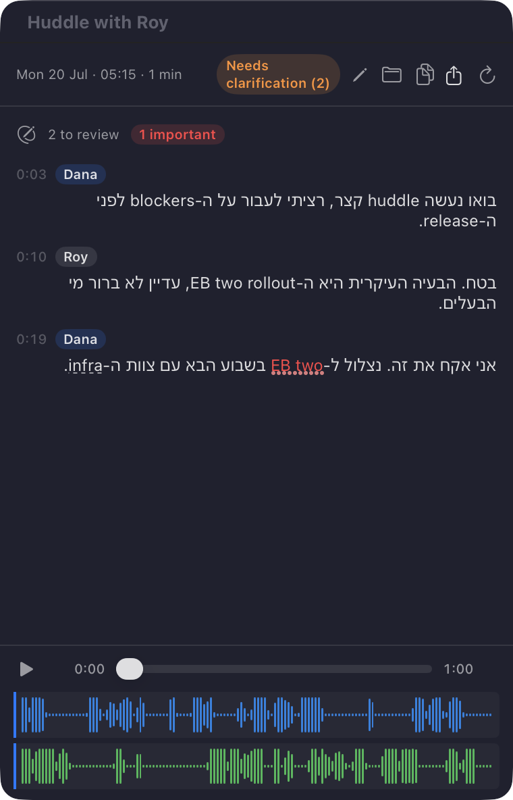

<p align="center">
  
</p>

<h1 align="center">Tamlil</h1>

<p align="center">
  <strong>Automatic, private transcription for meetings that mix Hebrew and English.</strong>
</p>

<p align="center">
  <a href="https://github.com/Steven17D/tamlil/actions/workflows/ci.yml"></a>
  <a href="LICENSE"></a>
  <a href="Tamlil/Package.swift"></a>
  <a href="pyproject.toml"></a>
</p>

Tamlil is a macOS menu-bar app that records your Zoom and Slack calls and turns
them into clean, speaker-labeled transcripts — even when the conversation
switches between Hebrew and English in the middle of a sentence. It starts
recording on its own when a call begins, and the transcript is waiting for you
the moment you hang up. Everything stays on your Mac; all that ever leaves it
is the transcription request — the call audio plus a short recognition hint
(meeting title, attendee names, learned terms) — and Tamlil deletes the upload
from the provider as soon as the transcript comes back.

<p align="center">
  
</p>

## Why Tamlil

- **It records itself.** Join a Zoom call or a Slack huddle and Tamlil starts
  capturing; hang up and the transcript builds automatically. Nothing to launch,
  click, or remember to turn on.
- **Built for Hebrew and English together.** Most transcribers make you pick one
  language per meeting. Tamlil keeps up with real bilingual speech, tagging each
  word's language, so a sentence that starts in Hebrew and ends in English comes
  out right.
- **Every speaker labeled — and playable.** Your side and the other side are
  separated and named, and the finished recording plays back inline with a
  waveform, so you can jump to any line and hear exactly what was said.
- **Correct it as you read; it remembers.** Tamlil flags the words it was unsure
  of right in the transcript. Fix one and it learns the term for every future
  meeting, so your names, products, and jargon stop coming back wrong.
- **Private by default.** Recordings, transcripts, and your learned vocabulary
  live only on your Mac. Your API key sits in the Keychain, never in a file.
  After each meeting Tamlil deletes both the audio and the transcript from the
  provider, so nothing lingers off your device.
- **Answers from your AI assistant.** A read-only connector lets Claude Code or
  Codex read your finished meetings and answer questions or draft summaries.

## A look inside

<table>
<tr>
<td width="50%" valign="top" align="center">

<em>Every call in one list — recording, processing, or ready to read.</em>
</td>
<td width="50%" valign="top" align="center">

<em>Unsure words are flagged inline; fix one and Tamlil learns it for good.</em>
</td>
</tr>
</table>

## Install

One command. You need macOS 15 (Sequoia) or later on an Apple-Silicon Mac and
the Xcode Command Line Tools 16 or later (`xcode-select --install`; the build
needs their Swift 6 toolchain); the installer handles everything else.

```bash
curl -fsSL https://raw.githubusercontent.com/Steven17D/tamlil/main/scripts/install.sh | zsh
```

It clones Tamlil, builds and installs the app, puts the transcript connector on
your PATH, asks for your Soniox API key (from
[console.soniox.com](https://console.soniox.com)), and launches. The first time
a call records, macOS asks you to approve **Microphone** and **System Audio
Recording** — say yes. Re-running the command updates an existing install.
Optional meeting titles from Google Calendar need a one-time OAuth-client setup
first — see [Google Calendar setup](#google-calendar-setup-bring-your-own-oauth-client).

<details>
<summary>Prefer to install by hand?</summary>

```bash
git clone https://github.com/Steven17D/tamlil.git
cd tamlil
uv sync                                     # Python deps (install uv from astral.sh/uv)
make app                                    # build Tamlil.app
rm -rf /Applications/Tamlil.app && cp -R Tamlil/dist/Tamlil.app /Applications/
defaults write dev.dashevsky.tamlil repoPath "$PWD"
scripts/launch-agent.sh restart            # launch under crash supervision

# store your Soniox key in the Keychain (never in a file)
security add-generic-password -s tamlil-soniox -a soniox -w "<KEY>" -U
```

To read meetings from an AI agent, also put the connector on your PATH:
`uv tool install --force .` then
`claude mcp add tamlil --scope user -- "$HOME/.local/bin/tamlil-mcp"`.
</details>

**Updating.** Click **Check for updates** in the menu, or re-run the install
command — Tamlil pulls the latest, rebuilds from source, and relaunches.

## How it works

1. **Join a call.** When a call app (Zoom, or a Slack call or huddle) starts
   using your microphone, Tamlil records two local tracks: your mic and the
   meeting's system audio.
2. **Hang up.** Recording stops with the call, and transcription runs
   automatically on the finished recording.
3. **Read the transcript.** The two tracks are transcribed, merged and
   speaker-labeled, cleaned of mic echo, and rewritten through your learned
   vocabulary. The finished transcript appears in the menu-bar app and is saved
   under `~/Recordings/Tamlil/`.
4. **Ask an agent (optional).** Claude Code or Codex reads finished meetings over
   the read-only connector and writes its own summaries.

For how the menu-bar app, pipeline, transcription, lexicon, connector, and
Google Calendar fit together, see the
[architecture overview](docs/architecture.md).

## Privacy and data handling

Tamlil records real meeting audio, so it is worth being precise about what
leaves your machine and what does not. The transcription provider is
[Soniox](https://soniox.com); the facts below are grounded in Soniox's published
Terms of Service and Privacy Policy (both last updated 2026-06-29).
`docs/soniox-data-processing.md` has the full write-up and sources.

- **What is captured.** Two local audio tracks per meeting: your microphone
  (`raw/mic.wav`) and the meeting app's system audio (`raw/system.wav`).
  Recording starts automatically when a call app begins capturing your mic.
- **What leaves your machine.** Traffic to two services, nothing else. The two
  audio tracks are uploaded to Soniox's async speech-to-text API (default
  endpoint `api.soniox.com`), and each request carries a recognition hint —
  the meeting title, attendee names, and learned lexicon terms — so Soniox
  spells them correctly. If you connect Google Calendar, meeting titles and
  attendee names are read from it. The read-only connector serves agents
  locally and sends nothing anywhere.
- **Training and secondary use.** Soniox commits, in its binding Terms of
  Service and again in its Privacy Policy, that it does not use customer content
  to "train, fine-tune, evaluate, benchmark, or improve" its models or services,
  and that it does not sell it. This is the default; no opt-in is required.
- **Retention.** The async API is Soniox's storage service: uploaded audio and
  the resulting transcript are stored server-side with no automatic deletion, so
  cleanup is the caller's responsibility. After each run the pipeline deletes the
  stored transcription, which also removes the uploaded audio file, so under
  normal operation neither the audio nor the transcript text is retained by
  Soniox. (Deletion is best-effort: a failure is logged and does not fail the
  run. For a single-file `tamlil-transcribe` run, `--keep-remote` skips it.)
- **Data residency.** Because the pipeline calls the default `api.soniox.com`,
  audio and transcripts are processed and stored in the United States, unless a
  regional Soniox project (EU or Japan) was explicitly requested and configured.
- **Legal basis.** Usage is governed by Soniox's self-serve, click-through Terms
  of Service plus Privacy Policy. A data-processing agreement and a HIPAA BAA are
  available through the Soniox Console but are not automatic — unless one has
  been accepted for the account, neither is in force.
- **Calendar scope.** Roster lookup is read-only and optional. It requests the
  single scope `https://www.googleapis.com/auth/calendar.events.readonly` and
  reads only meeting titles and attendee names. The per-user refresh token lives
  in your macOS Keychain (`tamlil-google`); without it, meetings still record
  and transcribe, just without titles or attendee names.
- **Local storage.** Recordings, transcripts, and the learned lexicon stay on
  your Mac — recordings under `~/Recordings/Tamlil/<recording-id>/`, the learned
  dictionary at the repo root. The Soniox API key lives in the Keychain
  (`tamlil-soniox`), never in a file. The connector opens the recording database
  read-only.
- **Deletion.** To delete a recording locally, remove its directory under
  `~/Recordings/Tamlil/`. On Soniox, both the uploaded audio and the stored
  transcription are removed automatically after each run, so nothing needs to be
  deleted there by hand under normal operation.

To report a security issue, see [SECURITY.md](SECURITY.md).

### Recording consent

Tamlil records your microphone and the meeting app's system audio together, so
every participant's voice is captured. Recording a conversation is regulated by
wiretap and eavesdropping laws that turn on who agreed to be recorded, and those
laws differ by jurisdiction.

- **You are responsible for obtaining consent.** Tamlil is a local tool that
  records on your behalf. The person running it — not the project's author and
  not the software — is responsible for obtaining whatever consent the law requires
  from everyone on the call, and for doing so before recording starts.
- **All-party versus one-party.** Jurisdictions differ on how many participants
  must consent. In one-party jurisdictions (much of the United States) your own
  consent is enough. In all-party jurisdictions — often called two-party — every
  participant must consent: California requires the consent of all parties to a
  confidential communication (Penal Code section 632), and the EU generally
  requires a lawful basis and the participants' consent under the GDPR and
  national law. A call that crosses borders can leave you bound by the strictest
  rule that applies to anyone on it.
- **Not legal advice.** The above is general information, not legal advice, and
  it is not exhaustive. Consent rules vary by country, state, and context and
  they change over time. Check the law in your own jurisdiction and in each
  participant's, and get your own legal advice, before you record.

## For developers

Tamlil is two halves that share a recording database: a SwiftUI menu-bar app in
`Tamlil/` and a Python transcription pipeline in `src/tamlil/` (run through
`uv`). The commands below assume the checkout the installer creates at
`$HOME/Library/Application Support/Tamlil/repo`; substitute your own path if you
cloned elsewhere.

```bash
REPO="$HOME/Library/Application Support/Tamlil/repo"
cd "$REPO"
```

### Run the pipeline by hand

```bash
uv run tamlil-pipeline ~/Recordings/Tamlil/<recording-id>
```

The mic track is labeled with your macOS first name; override with `--me-name`.
Transcribe a single file with `uv run tamlil-transcribe path/to/audio.wav`. If a
run fails, the audio is preserved under `raw/` — fix the cause (usually the
Soniox key or balance) and re-run; `--skip-transcribe` reuses an existing merge
and only redoes the cheap local stages.

The pipeline, in order: look up the meeting roster and build recognition
context; optionally denoise the mic track; transcribe both tracks concurrently;
merge by timestamp with per-track speaker labels; suppress mic echo from the
system track; apply learned lexicon rewrites; save clarification cards from
low-confidence spans; and write `final/transcript.{json,md}`.

### Read meetings from an AI agent

The connector (an MCP server) is read-only over the recording database and
transcript files, exposing `list_meetings`, `get_meeting`, `get_transcript`, and
`search_transcripts`. The installer registers it with Claude Code for you; to
add it by hand:

```bash
claude mcp add tamlil -- uv run --project "$REPO" tamlil-mcp
```

For Codex (`~/.codex/config.toml`), point it at an absolute path:

```toml
[mcp_servers.tamlil]
command = "uv"
args = ["run", "--project", "/Users/<you>/Library/Application Support/Tamlil/repo", "tamlil-mcp"]
```

It honors `TAMLIL_DB_PATH` / `TAMLIL_RECORDINGS_ROOT` overrides and never
writes — the database is opened read-only.

### Recording storage

Each recording is a directory under `~/Recordings/Tamlil/<recording-id>/`:
`raw/` holds the captured `mic.wav` and `system.wav`; `work/` holds pipeline
intermediates (denoised audio, per-track transcripts, the merged draft, the echo
report); `final/` holds `transcript.json` and `transcript.md`; `logs/` holds the
pipeline log. `transcript.json` keeps segment text, speaker diarization, language
IDs, word timings and confidence, low-confidence spans, and the echo report.

### Google Calendar setup (bring your own OAuth client)

The calendar feature — meeting titles and attendee names, also fed to the
recognizer as context — is **optional** and stays off until you register your
own Google OAuth client and point Tamlil at it (Tamlil ships none of its own).
It's a five-minute, one-time setup: see
**[docs/google-calendar-setup.md](docs/google-calendar-setup.md)**.

### Source-first delivery

Tamlil is built and installed from source, not shipped as a notarized binary.
Two consequences are deliberate:

- **Ad-hoc code signing.** `Tamlil/build.sh` signs the app with `codesign
  --sign -` (no Developer ID, no notarization). Because you build it yourself,
  macOS runs it without a Gatekeeper detour, and the microphone and system-audio
  permission grants — keyed to the bundle id — survive every rebuild as long as
  the signature stays consistent.
- **Pull-and-rebuild updater.** **Check for updates** runs `scripts/update.sh`,
  which pulls the latest source into your checkout, rebuilds, reinstalls, and
  relaunches. There is no Sparkle feed or separate update channel to trust; the
  source you can read is the source that runs.

Because the app runs from your checkout, its repo path is a first-run setting
(**Settings → Pipeline → tamlil repo**); the installer sets it for you.

### Troubleshooting

- **No permission prompts / silent recordings** — check Tamlil is enabled under
  System Settings → Privacy & Security → Microphone and System Audio Recording,
  then relaunch. Grants are keyed to the bundle id and need re-approval if it
  ever changes.
- **`swift build` fails immediately** — install or update the Command Line
  Tools with `xcode-select --install`; the build needs CLT 16+ (Swift 6).
  `swift test` is not supported (the package defines no test target); use
  `make test-swift`, which runs the app's built-in self-check.
- **Pipeline error on a meeting** — the audio is preserved under `raw/`; re-run
  `uv run tamlil-pipeline <dir>` after fixing the cause (usually the Soniox key
  or balance).
- **Empty roster / no meeting titles** — run `uv run tamlil-auth` to connect your
  Google account; see the Google Calendar setup above.

### Contributing and stack

See [CONTRIBUTING.md](CONTRIBUTING.md). The stack: `uv` (Python 3.12), Soniox
`stt-async-v5`, `requests`, `numpy`, `static-ffmpeg`, SwiftUI, and SQLite.

## License

Apache-2.0 — see [LICENSE](LICENSE). Bundled third-party components are
credited in [NOTICE](NOTICE) and [THIRD_PARTY_LICENSES](THIRD_PARTY_LICENSES).
</content>
