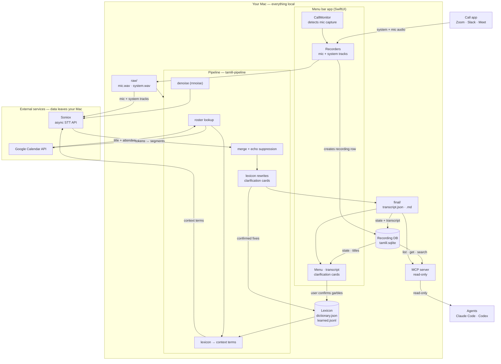

# Architecture

Tamlil turns a Zoom, Slack, or Meet call into a timestamped, speaker-labeled
transcript. Two halves cooperate: a SwiftUI menu bar app that records the call,
and a Python pipeline that transcribes it through the Soniox async API. Almost
everything runs and stays on your Mac; only two things leave it, both drawn in
the "External services" box below.

## Data flow

## Walkthrough

1. **Detect and record.** When a call app starts capturing your microphone,
   `CallMonitor` in the menu bar app notices and begins recording two local
   tracks — your mic and the meeting app's system audio — into
   `~/Recordings/Tamlil/<recording-id>/raw/`. A row for the recording is created
   in the shared SQLite database (`tamlil.sqlite`).

2. **Run the pipeline.** After hangup, the app launches `tamlil-pipeline` on the
   recording directory. The pipeline is a fixed sequence of stages, each writing
   its intermediate artifacts under `work/`.

3. **Roster and context terms.** The roster stage optionally reads the meeting's
   title and attendee names from Google Calendar over a read-only OAuth token,
   and the lexicon contributes learned terms. Together they become the context
   terms handed to Soniox so it spells names and jargon correctly.

4. **Denoise and transcribe.** The mic track is denoised for clarification
   playback, then both the mic and system tracks are uploaded to the Soniox
   async speech-to-text API and transcribed concurrently. Soniox returns tokens
   that the pipeline groups into timestamped, diarized segments.

5. **Merge, suppress echo, rewrite.** The two tracks are merged by timestamp with
   per-track speaker labels; mic echo is suppressed out of the system track;
   learned lexicon rewrites are applied; and low-confidence spans become
   clarification cards.

6. **Write the transcript.** The finished transcript is written to
   `final/transcript.json` and `final/transcript.md`, and the recording's state
   is updated in the database.

7. **Review and learn.** The app shows the transcript and its clarification
   cards. When you confirm a garbled term, the correction is written back to the
   local lexicon (`dictionary.json` / `learned.jsonl`) so the next meeting spells
   it right — this is the only feedback loop, and it never leaves your machine.

8. **Expose to agents.** The read-only MCP server serves finished meetings out of
   the database and transcript files (`list_meetings`, `get_meeting`,
   `get_transcript`, `search_transcripts`). Agents such as Claude Code and Codex
   pull meetings over MCP and do their own summarization; they never write back.

## Components

- **Menu bar app** (`Tamlil/`, SwiftUI) — call detection, two-track recording,
  transcript and clarification UI, and it launches the pipeline. Shares
  `tamlil.sqlite` and the recording directory layout with the Python half.
- **Recording database** (`recording_db.py`, `recording_layout.py`) — SQLite
  store of recording metadata, state, speaker names, and clarification cards,
  read and written by both the app and the pipeline; opened read-only by MCP.
- **Pipeline** (`meeting_pipeline.py`, `tamlil-pipeline`) — orchestrates the
  stages above for one recording directory.
- **Soniox client** (`transcribe_soniox.py`) — the async API client: upload,
  poll, tokens to segments, low-confidence spans. Soniox is the one required
  external service; see [Privacy and data handling](../README.md#privacy-and-data-handling)
  for what is sent and retained.
- **Lexicon** (`lexicon.py`, plus the gitignored `dictionary.json` /
  `learned.jsonl`, seeded by `src/tamlil/terms.txt`) — the learned dictionary
  that supplies Soniox context terms and rewrites garbles you have corrected.
- **Roster / Calendar** (`roster.py`, `google_oauth.py`) — optional Google
  Calendar lookup over a per-user OAuth token for meeting titles and attendees.
- **Audio cleanup** (`denoise.py` with the bundled rnnoise model, `echo.py`) —
  mic denoising and direction-aware echo suppression.
- **MCP server** (`mcp_server.py`, `tamlil-mcp`) — read-only access to the
  database and transcripts for agents.

## Trust boundary

Two things leave your Mac, and nothing else:

- The two audio tracks are uploaded to the **Soniox** async STT API for
  transcription.
- If you connect it, meeting titles and attendee names are read from **Google
  Calendar** over a read-only scope.

The recording database, the learned lexicon, the finished transcripts, and the
MCP server all stay entirely local. See the README's
[Privacy and data handling](../README.md#privacy-and-data-handling) section for
the details on capture, retention, and deletion.
